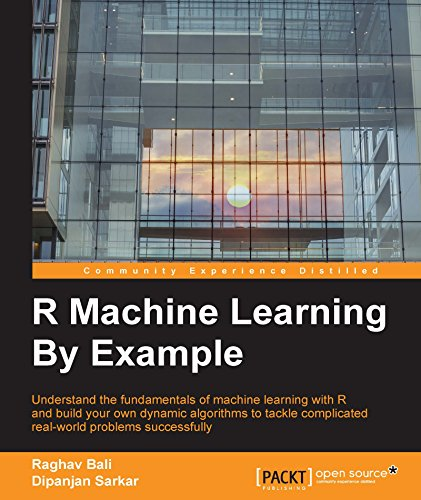

# R Machine Learning by Example
> by Raghav Bali and Dipanjan Sarkar

Understand the fundamentals of machine learning with R and build your own dynamic algorithms to tackle complicated real-world problems successfully

[*__"R Machine Learning by Example"__*](https://github.com/raghavbali/r_machine_learning_by_example)  follows a structured and comprehensive three-tiered approach packed with concepts, methodologies, hands-on examples, and code. 
## Get the book 

 

 

  

## About the book 

Data science and machine learning are some of the top buzzwords in the technical world today. From retail stores to Fortune 500 companies, everyone is working hard to making machine learning give them data-driven insights to grow their business. With powerful data manipulation features, machine learning packages, and an active developer community, R empowers users to build sophisticated machine learning systems to solve real-world data problems.

This book takes you on a data-driven journey that starts with the very basics of R and machine learning and gradually builds upon the concepts to work on projects that tackle real-world problems.

You'll begin by getting an understanding of the core concepts and definitions required to appreciate machine learning algorithms and concepts. Building upon the basics, you will then work on three different projects to apply the concepts of machine learning, following current trends and cover major algorithms as well as popular R packages in detail. These projects have been neatly divided into six different chapters covering the worlds of e-commerce, finance, and social-media, which are at the very core of this data-driven revolution. Each of the projects will help you to understand, explore, visualize, and derive insights depending upon the domain and algorithms.

Through this book, you will learn to apply the concepts of machine learning to deal with data-related problems and solve them using the powerful yet simple language, R.

Edition: 1st &emsp; Pages: 340 &emsp; Language: English 
 Book Title: R Machine Learning by Example &emsp; Publisher: Packt &emsp; Copyright: Dipanjan Sarkar, Raghav Bali   
 Print ISBN: 978-1-78439-084-6 &emsp; Online ISBN: 978-1-78439-084-6 

 

## What You'll Learn

 - Utilize the power of R to handle data extraction, manipulation, and exploration techniques
 - Use R to visualize data spread across multiple dimensions and extract useful features
 - Explore the underlying mathematical and logical concepts that drive machine learning algorithms
 - Dive deep into the world of analytics to predict situations correctly
 - Implement R machine learning algorithms from scratch and be amazed to see the algorithms in action
 - Write reusable code and build complete machine learning systems from the ground up
 - Solve interesting real-world problems using machine learning and R as the journey unfolds
 - Harness the power of robust and optimized R packages to work on projects that solve real-world problems in machine learning and data science

## Audience

If you are interested in mining useful information from data using state-of-the-art techniques to make data-driven decisions, this is a go-to guide for you. No prior experience with data science is required, although basic knowledge of R is highly desirable. Prior knowledge in machine learning would be helpful but is not necessary.
 

